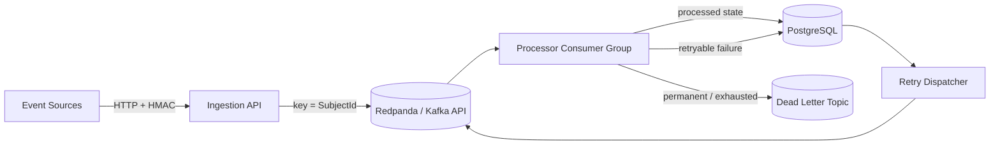
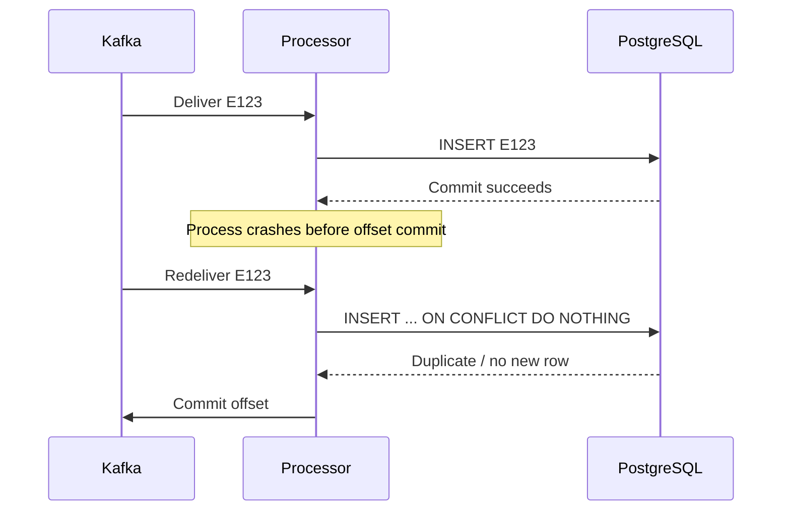

# Event Processing Platform

A .NET reference implementation of a durable asynchronous event-processing pipeline.

The project explores the failure modes that make event-driven backend systems more difficult than simply publishing to Kafka: duplicate delivery, offset timing, idempotency, retry durability, poison messages, dead-letter handling, graceful shutdown, partition ordering, observability, and repeatable load testing.

It is intentionally generic and independently designed. The domain is a small demo transform operation so the repository can focus on distributed-systems behavior rather than business complexity.

## Architecture



### Service boundaries

- **EventPlatform.Api** validates signed HTTP requests and publishes events. It returns `202 Accepted` only after the Kafka-compatible broker acknowledges the message.
- **EventPlatform.Processor** consumes as part of a Kafka consumer group, validates events, performs the demo operation, persists an idempotent result, and decides between retry and dead-letter outcomes.
- **EventPlatform.RetryDispatcher** claims due PostgreSQL retry rows and republishes them. Retry rows are deleted only after broker acknowledgement.
- **PostgreSQL** is the durable idempotency and delayed-retry store.
- **Redpanda** provides the Kafka protocol locally: topics, partitions, keys, offsets, replay, and consumer groups.
- **OpenTelemetry** exports custom traces and metrics to the local collector, Prometheus, Tempo, and Grafana.

See [system overview](docs/architecture/system-overview.md) and [reliability model](docs/reliability.md).

## Event contract

```json
{
  "eventId": "3cfbc964-57db-45ea-924f-975f011e96cb",
  "eventType": "demo.work.requested",
  "source": "sample-producer",
  "subjectId": "subject-1287",
  "schemaVersion": 1,
  "occurredAt": "2026-10-04T10:00:00Z",
  "correlationId": "b146b9cb-2f84-4fe0-b875-30aba73f419c",
  "payload": {
    "operation": "transform",
    "value": 42
  }
}
```

`EventId` is the application idempotency key. `SubjectId` is the Kafka message key.

## Delivery semantics

The platform implements **at-least-once processing with idempotent side effects**.

It does **not** claim exactly-once processing.

A representative failure window:



The PostgreSQL primary key on `processed_events.event_id` makes this redelivery safe.

## Partitioning

Events are keyed by `SubjectId`.

That gives ordering for one logical subject while allowing different subjects to be processed across multiple partitions and consumer instances.

The trade-off is explicit: a very hot subject can create a hot partition. The platform does not claim global ordering.

## Retry strategy

Retryable application failures are not implemented as long sleeps inside a Kafka consumer.

Instead:

1. the processor persists a retry row with `next_attempt_at`,
2. only then does it commit the source Kafka record,
3. the retry dispatcher claims due rows with `FOR UPDATE SKIP LOCKED`,
4. it republishes the event,
5. it removes the retry row only after broker acknowledgement.

The default retry delays are approximately 1 second, 5 seconds, and 30 seconds with bounded jitter.

If PostgreSQL itself is unavailable, the processor cannot durably schedule a retry, so it intentionally does **not** commit the source offset.

## Dead-letter handling

Permanent events such as malformed JSON, unsupported schemas/types, or invalid demo payloads are sent to:

```
event-platform.events.dlq.v1
```

Retry exhaustion also ends in the DLQ.

The original source offset is committed only after the DLQ publication succeeds. If DLQ publication fails, the source record remains recoverable.

## Schema versioning

The current envelope explicitly supports `schemaVersion = 1`.

A Schema Registry is deliberately not included yet: one controlled public schema does not justify the additional infrastructure. Unsupported versions are treated as permanent failures.

## Security

HTTP ingestion uses HMAC-SHA256.

The signature is verified against the **exact request bytes received**, before deserialization. Digest comparison uses fixed-time comparison.

The repository does not log signing secrets or full event payloads by default.

## Local startup

Prerequisites:

- Docker with Docker Compose
- optional: .NET 10 SDK for local builds/tests
- optional: k6 for load testing

Start everything:

```bash
docker compose up --build
```

Key endpoints:

| Component | Address |
|---|---|
| API | http://localhost:8080 |
| API liveness | http://localhost:8080/health/live |
| API readiness | http://localhost:8080/health/ready |
| Grafana | http://localhost:3000 |
| Prometheus | http://localhost:9090 |
| Tempo | http://localhost:3200 |
| Kafka external listener | localhost:9092 |
| PostgreSQL | localhost:5432 |

The Compose file automatically provisions the Kafka topics and PostgreSQL schema.

## Send an event

```bash
chmod +x scripts/*.sh
./scripts/send-event.sh
```

A successful request receives `202 Accepted` only after broker acknowledgement.

## Demonstrate idempotency

```bash
./scripts/simulate-duplicate.sh
```

The same `EventId` is published twice. Kafka can contain duplicate deliveries; PostgreSQL still records one logical processed result.

## Demonstrate delayed retry

```bash
./scripts/simulate-retry.sh
```

The sample event uses a deterministic demo failure instruction so the original attempt and retry 1 fail, then retry 2 succeeds.

## Demonstrate retry exhaustion / DLQ

```bash
./scripts/simulate-dlq.sh
```

Inspect the DLQ:

```bash
docker compose exec redpanda \
  rpk topic consume event-platform.events.dlq.v1 -n 1 \
  -X brokers=redpanda:29092
```

More scenarios are documented in [failure-scenarios.md](docs/failure-scenarios.md).

## Scale the consumer group

```bash
docker compose up -d --scale processor=2
```

Both processor instances join `event-platform-processors-v1`; Kafka assigns partitions across the group.

## Observability

The application emits OpenTelemetry traces and metrics.

The local stack contains:

- OpenTelemetry Collector,
- Prometheus,
- Tempo,
- Grafana.

The provisioned Grafana dashboard includes ingestion, processing, duplicate, retry, and dead-letter signals.

Custom metrics intentionally avoid high-cardinality identifiers such as `EventId`, `CorrelationId`, and `SubjectId`.

## Build and test

```bash
dotnet restore EventPlatform.sln
dotnet build EventPlatform.sln --configuration Release
dotnet test tests/EventPlatform.UnitTests/EventPlatform.UnitTests.csproj --configuration Release
dotnet test tests/EventPlatform.IntegrationTests/EventPlatform.IntegrationTests.csproj --configuration Release
```

Integration tests use disposable real Kafka and PostgreSQL containers via Testcontainers.

For an end-to-end check:

```bash
docker compose up -d --build
./scripts/smoke-test.sh
```

See [testing.md](docs/testing.md).

## Load testing

A k6 ingestion workload is included:

```bash
VUS=50 DURATION=60s SUBJECT_COUNT=5000 \
  k6 run benchmarks/k6/ingestion.js
```

See [performance.md](docs/performance.md) for the required benchmark methodology.

### Published benchmark results

**No verified throughput result is currently published.**

This repository intentionally avoids fabricated or decontextualized performance claims. Any future result must record the commit, hardware, runtime versions, partition count, processor count, payload size, duration, and k6 configuration.

## Design decisions

Architecture Decision Records:

- [ADR 001 — Kafka-compatible broker](docs/adr/001-kafka-compatible-broker.md)
- [ADR 002 — At-least-once delivery](docs/adr/002-at-least-once-delivery.md)
- [ADR 003 — SubjectId partition key](docs/adr/003-partition-key.md)
- [ADR 004 — PostgreSQL retry scheduling](docs/adr/004-postgres-retry-scheduling.md)
- [ADR 005 — Database-enforced idempotency](docs/adr/005-idempotency.md)
- [ADR 006 — Explicit schema versioning](docs/adr/006-schema-versioning.md)
- [ADR 007 — OpenTelemetry observability](docs/adr/007-observability.md)

## Key trade-offs

### Why Redpanda locally?

It keeps local infrastructure small while preserving Kafka protocol concepts. Application code uses `Confluent.Kafka`, not a Redpanda-specific client.

### Why PostgreSQL for delayed retries?

Kafka is durable transport, but long delayed retries are awkward if implemented as consumer sleeps. PostgreSQL gives the retry schedule a durable, queryable time dimension and supports safe concurrent claiming with `SKIP LOCKED`.

### Why not exactly once?

The project wants its claims to survive scrutiny. Exactly-once broker features do not automatically make arbitrary external side effects exactly once. Explicit idempotency makes the failure model easier to reason about and demonstrate.

### Why no Kubernetes or cloud deployment?

The engineering goal is application-level reliability: delivery semantics, offsets, retries, idempotency, failure handling, and observability. Container orchestration would add surface area without strengthening those concepts.

### Why no Schema Registry?

There is currently one controlled versioned envelope. The repository documents the point at which a registry would become useful rather than adding it for a technology checklist.

## Repository structure

```text
src/
  EventPlatform.Api/
  EventPlatform.Contracts/
  EventPlatform.Domain/
  EventPlatform.Infrastructure/
  EventPlatform.Processor/
  EventPlatform.RetryDispatcher/

tests/
  EventPlatform.UnitTests/
  EventPlatform.IntegrationTests/

deploy/
  grafana/
  otel/
  postgres/
  prometheus/
  tempo/

docs/
  adr/
  architecture/

benchmarks/
  k6/
  results/

scripts/
```

## Non-goals

This repository deliberately does not add Kubernetes, Terraform, Redis, RabbitMQ, service mesh, event sourcing, CQRS frameworks, or cloud services simply to enlarge the stack.

## Disclaimer

This is an independently designed portfolio/reference project. It uses generic event-processing concepts and does not contain or reproduce proprietary employer code, schemas, business logic, naming, or architecture.
