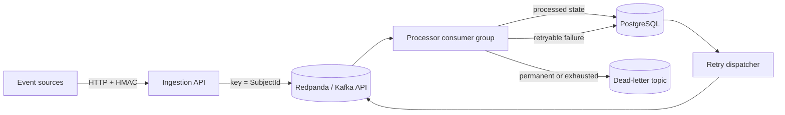

# System overview

The Event Processing Platform separates ingestion, durable transport, processing, retry scheduling, and observability into explicit boundaries.

## Boundaries

- **API** validates the exact signed request bytes, validates the event envelope, publishes to Kafka, and returns 202 only after broker acknowledgement.
- **Broker** provides durable transport, partition ordering, consumer-group coordination, and replay through offsets.
- **Processor** validates consumed events, performs the demo transform, enforces idempotency through PostgreSQL, classifies failure outcomes, schedules retries, and publishes permanent/exhausted failures to the DLQ.
- **Retry dispatcher** claims due retry rows with `FOR UPDATE SKIP LOCKED`, republishes them, and deletes the retry row only after broker acknowledgement.
- **PostgreSQL** stores processed-event identity and the durable delayed-retry schedule.
- **OpenTelemetry** exports application traces and metrics to the local collector, Prometheus, Tempo, and Grafana.

The demo domain is intentionally small. The engineering focus is delivery semantics, failure windows, idempotency, retry durability, and operational visibility.
